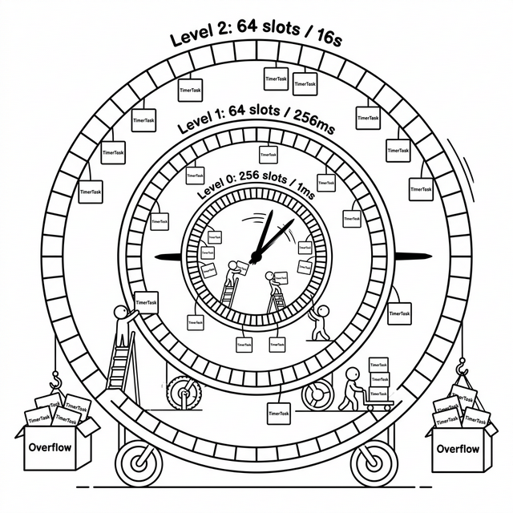

# 5. 时空的刻度：高效定时器与事件循环的融合

每一个工程师在第一次深入 QUIC 协议规范时，大概都会有一个共同的震惊时刻——这个协议对"时间"有着近乎变态的依赖。

在 TCP 的世界里，超时重传只是一个可以被系统内核朴素处理的附带功能，开发者大多数时候甚至感知不到它的存在。但在 QUIC 的世界里，时间是整个协议能否正确运转的命根子：

- **PTO（Probe Timeout）**：每隔十几毫秒探测一次网络拥塞窗口，超时即触发重传探针。
- **RTT 采样**：需要精密的毫秒级时间戳来测量每一个 ACK 的往返时延，进而动态调整传输速率。
- **握手超时**：Initial 握手阶段若 1 秒内没有收到对端回音，就必须果断断连。
- **连接空闲超时**：长期没有报文活动的连接必须按时被清理，避免协议状态机的内存泄漏。

一个服务端 Worker 线程同时处理的 QUIC 连接可能有成千上万条，也就意味着同时在飞的定时器任务多达数万个。对这把定时器提出的要求是十分苛刻的：**注册和取消定时器必须极快，并且在每个 EventLoop 回合里能够以最低的成本告知"下一个最近的任务几毫秒后到期"。**

---

## 5.1 最朴素的起点：TreeMapTimer

在 `quicX` 迭代的早期阶段，我们使用的是结构最简单的 `TreeMapTimer`。它的核心数据结构只有一行：

```cpp
// 时间戳(ms) → 同时刻到期任务的集合
std::map<uint64_t, std::unordered_map<uint64_t, TimerTask>> timer_map_;
```

`std::map` 按 Key（超时时刻）自动排好序，因此 `TimerRun` 只需从头部开始扫描，把所有 Key ≤ 当前时间的任务取出依次触发。逻辑透明，代码量极少，正确性毋庸置疑。

但它的致命伤在 `AddTimer` 上：向红黑树插入一个新节点需要 **O(log N)** 的旋转维护代价。在一个同时维护着几万条连接、每条连接又有多个独立定时器的 Worker 线程上，高频的 PTO 定时器重置（每次 ACK 收到或丢包都要取消再重新注册一个探测定时器）会让这个 logN 开销被迅速放大成一根不可忽视的性能刺。

我们需要一种 **O(1)** 的方案。

---

## 5.2 时间轮：把时间映射成空间

时间轮（Timing Wheel）的思想来自一个极其朴素的日常物件——**时钟的表盘**。

一个表盘上有 60 个刻度（槽），秒针每走过一格，代表 1 秒过去了。如果我们想在 30 秒后触发一个任务，就把这个任务"挂"在当前秒针位置向后数 30 格的那个槽里。每当秒针走到某个格子，就无差别地触发该格子里所有挂着的任务。

注册一个定时器，就是做一次取模运算算出槽号，然后把任务挂进去——**O(1)**。
触发到期任务，就是读取当前指针所处格子的任务列表并依次执行——**O(k)**，k 为同时到期的任务数。

这是一个近乎完美的解法，但有一个明显的局限：精度和时间跨度无法兼得。如果每槽代表 1ms，一个有 256 个槽的时间轮只能覆盖 256ms 的范围。如果要覆盖更长的时间（比如 QUIC 握手的 1 秒超时），就必须要么增大槽数，要么牺牲精度。

解法是借鉴真实时钟的智慧：**引入多级表盘**。

---

## 5.3 三级时间轮：嵌套表盘的工程奇技

真实的时钟并不用 86400 个格子来表达一天的所有时间，而是用三个嵌套的表盘——秒针、分针、时针——来覆盖从秒到小时的全范围时间刻度。`quicX` 的 `TimingWheelTimer` 采用了同样的思路，构造了三级层叠的表盘：

```
Level 0: 256 槽 × 1ms/槽  =     256ms 覆盖范围   （"秒针"）
Level 1:  64 槽 × 256ms/槽 =  16,384ms 覆盖范围   （"分针"）
Level 2:  64 槽 × 16384ms/槽 = 1,048,576ms 覆盖范围 （"时针"，约 17.5 分钟）
Overflow:  溢出链表，存放超过 17.5 分钟的任务
```

注册一个新定时器时，根据它距当前时刻的超时时长，决定它该落入哪一级的哪一个槽：

```cpp
void TimingWheelTimer::Insert(TimerTask& task, uint64_t reference) {
    uint64_t delta = task.time_ - reference;

    if (delta < kL0Range) {
        uint32_t s = (uint32_t)task.time_ & kL0Mask;      // 落在 Level 0
        place(wheel0_[s], 0, s);
    } else if (delta < kL1Range) {
        uint32_t s = (task.time_ >> kL0Bits) & kL1Mask;   // 落在 Level 1
        place(wheel1_[s], 1, s);
    } else if (delta < kL2Range) {
        uint32_t s = (task.time_ >> (kL0Bits + kL1Bits)) & kL2Mask; // 落在 Level 2
        place(wheel2_[s], 2, s);
    } else {
        place(overflow_, 3, 0);                             // 溢出链表
    }
}
```

整个 `Insert` 里全部是位运算和数组下标访问，**AddTimer 因此是严格的 O(1)**。

当"秒针"（Level 0）走完一圈（256ms），触发一次高层级的 **Cascade（级联下沉）**：把 Level 1 当前槽里的任务重新按照新的时间距离分发回 Level 0 或其他层级；同理，Level 1 走完一圈时 Cascade Level 2，以此类推。就像时钟里分针走过 60 格之后时针才拨动一格——高层表盘的任务源源不断地往低层涌下来，被更精细地调度。



---

## 5.4 O(1) 取消：location_map 的救命细节

仅仅有了 O(1) 注册还不够——在网络库里，**定时器取消**的频率绝不亚于注册。每收到一个 ACK，对应的重传定时器必须立刻被取消；连接关闭时，所有挂在这条连接上的定时器必须批量清除。

时间轮的朴素设计里没有 O(1) 取消的能力，因为任务被切碎分布在不同的槽里，要找到某个特定任务，就必须遍历整个轮子——O(N) 开销在高处理量场景下令人绝望。

`quicX` 用一个精巧的辅助结构彻底解决了这个问题：**`location_map_`**。

```cpp
// Timer ID → 该任务在槽位 list 中的迭代器
std::unordered_map<uint64_t, std::list<TimerTask>::iterator> location_map_;
```

每当一个任务被插入某个槽的 `std::list` 时，它在那个 list 里的迭代器会被立刻记录进 `location_map_`。取消定时器时，只需：

1. 用 Timer ID 在 `location_map_` 里 O(1) 查找到迭代器
2. 通过迭代器 O(1) 从 list 里直接 `erase`
3. 从 `location_map_` 里 O(1) 删除记录

整个取消操作从头到尾都是 O(1)，借助 `std::list` 迭代器的稳定性（list 元素的插入删除不使其他迭代器失效）优雅实现。

---

## 5.5 MinTime 的懒更新缓存

除了注册和取消，定时器还必须不断地回答一个问题：**距离下一个任务到期还有多少毫秒？**

这个问题由 `EventLoop::Wait()` 每个回合都会问一次，用来决定 `epoll_wait` 的阻塞超时时长。如果这个查询很慢，EventLoop 的整个调度精度就会受到拖累。

扫描整个时间轮找到最近的截止时刻，`EarliestDeadline()` 函数需要扫描全部 256 + 64 + 64 = 384 个槽——这个 O(W) 的扫描每回合都做一遍，代价太高。

`quicX` 在此引入了一个**懒更新的最小值缓存**：

```cpp
uint64_t min_deadline_cache_ = UINT64_MAX;  // 当前最近的截止时刻
bool     cache_dirty_        = false;       // 为 true 时表示缓存已失效
```

- **`AddTimer`**：新任务的截止时刻如果比 `min_deadline_cache_` 更早，立刻更新缓存。全程 O(1)，因为新增任务只可能让最小值更小，不可能更大。
- **`RemoveTimer` / 任务触发**：如果被删除或触发的任务恰好是当前缓存记录的最小值，才把 `cache_dirty_` 标为 `true`。
- **`MinTime()` 被调用时**：若 `cache_dirty_` 为 `true`，做一次 O(W) 全量扫描重建缓存，然后立刻清除脏标记。之后的调用直接读缓存，O(1) 返回。

全量扫描最多被推迟到下一次 `MinTime()` 的调用，而绝大多数情况下发生"取消/触发最小值任务"后在很快的下一帧 `MinTime()` 就会触发一次重建，重建结果又可以被多个后续回合复用。这是一种**以边界精准化换取均摊低开销**的优雅设计。

---

## 5.6 与 EventLoop 的最终融合

定时器模块并不是一个独立运转的黑盒，它和 EventLoop 紧密缠绕，共同构成了整个时间调度的齿轮组。

在 `EventLoop::Wait()` 的每个回合里，定时器被精确地嵌入进来：

```cpp
int EventLoop::Wait() {
    uint64_t now = UTCTimeMsec();

    // 第一步：触发所有已到期的定时任务
    timer_->TimerRun(now);

    // 第二步：查询下一次最近到期时刻，作为 epoll_wait 的阻塞上限
    int32_t next_ms  = timer_->MinTime(now);
    int     timeout_ms = next_ms >= 0 ? next_ms : 1000;  // 无任务时最长等 1 秒

    // 第三步（同源唤醒优化，第三章已详述）
    if (need_immediate_wakeup_) {
        timeout_ms = 0;
        need_immediate_wakeup_ = false;
    }

    // 第四步：带精确超时地等待网络事件
    driver_->Wait(events_, timeout_ms);

    // 第五步：处理 FD 事件 + 跨线程 PostTask 队列
    // ...
}
```

这段代码揭示了整个时间调度机制最关键的一个设计决策：**`quicX` 没有使用 `timerfd` 或 `SIGALRM` 之类的系统级定时器信号，而是完全依赖 EventLoop 自身的 `epoll_wait` 超时来精确 "叫醒" 自己**。

定时器的精度，就等于 EventLoop 每一个回合的响应延迟。在负载正常时，一个 Worker 线程的 `epoll_wait` 被设置的超时时长，正是下一个最早到期的 PTO 探针定时器对应的毫秒数。时钟精确地滴答作响，连系统调用的数量也被压缩到了极致。

这也意味着，整套定时器体系不需要任何额外的线程，不需要任何额外的锁，不产生任何额外的上下文切换——它嵌入在 EventLoop 固有的驱动力里，随着大循环的每一下转动雷打不动地如期运行。

---

至此，构成 `quicX` 高性能地基的五根支柱已经全部竖起：

| 章节 | 支柱 | 核心价值 |
|------|------|----------|
| 第一章 | **内存池** | 消灭小对象高频 malloc 的系统调用开销 |
| 第二章 | **零拷贝 Buffer** | 屏蔽数据拷贝，用轻量引用代替实体搬运 |
| 第三章 | **网络 IO 抽象** | 单线程事件驱动，跨平台统一 fd 管理 |
| 第四章 | **无锁并发模型** | 线程隔离设计，把并发复杂性封死在架构边界 |
| 第五章 | **高效定时器** | O(1) 时间轮与 EventLoop 深度融合，精密驱动协议时序 |

这五章所描述的并不是五个独立的模块，而是一套精心设计、互相扣合的机械传动系统。内存池的 `thread_local` 设计使定时器回调中的内存分配无锁；零拷贝 Buffer 让网络 IO 的回调里不再有大块内存的复制阻塞；EventLoop 则把"时钟滴答"和"网络事件"合并在同一根轴上，以极低的资源代价驱动着整个协议引擎的心跳。

接下来，建立在这套地基之上的 QUIC 协议握手、流控与可靠传输，才是真正的主角登场。
