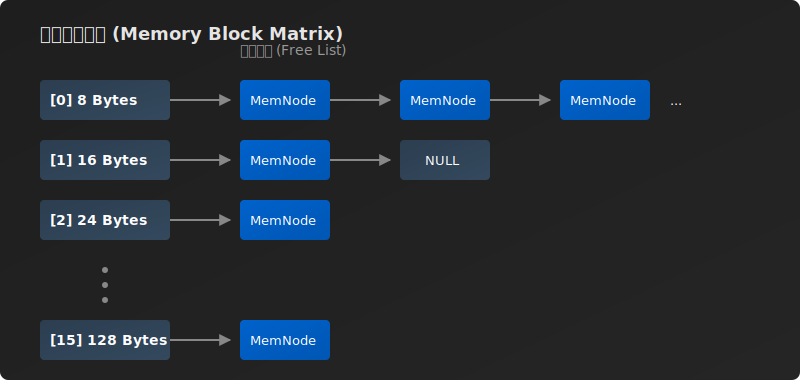
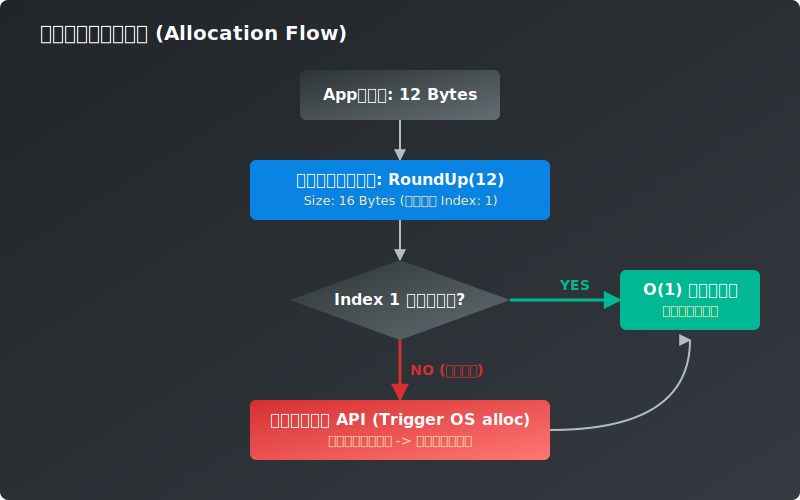

# 1. 内存的七巧板：内存池的设计

凡遇到高性能问题，池化技术往往是不二法门。quicX作为一个高性能的网络库，自难以接受直接操作系统接口带来的性能损耗。

在深入探讨内存池的具体实现之前，我们必须先厘清一个核心问题：**在实现一个现代化的 QUIC 协议栈时，内存的压力究竟来自哪里？**

从全局视角来看，网络协议的实现面临两类截然不同的内存使用挑战：
1. **海量长短不一的小对象请求**：诸如记录 `Stream` 状态的上下文、各个子系统的定时器节点、ACK 回复的追踪区块。在握手校验和滑动窗口的流转中，QUIC 会像繁星一样产生无数这样几字节到几十字节不等的小对象。
2. **大块网络数据的吞吐收发**：用来装填甚至多次组装真实 Payload 网络分片的底层缓存 Buffer（往往是百字节到几千字节级别）。

本章，我们将聚焦于第一类挑战——即**如何优雅而极致地管理海量小对象的分配**。至于处理大块网络数据的缓存难题，我们将在下一章进行专门的探讨。

要说明为什么系统接口在处理这些海量小对象时性能损耗高，就需要将视角下探，看一看简单的一个 `malloc`，操作系统都背着我们干了些什么。

---

## 系统调用的代价是什么？
《断头王后》中有一句流传甚广的名言：所有命运给予的馈赠，都早已在暗中标好了价格。向操作系统申请内存看似轻描淡写，实则暗藏着三重致命的“隐形税”：

**第一重税：内核交互的昂贵成本。**
每次调用 `malloc` 遇到缺页中断或是堆扩展时，都会触发从用户态到内核态的上下文切换。在高频的 I/O 调度中，这种跨态侵扰会让 CPU 的宝贵时间片被白白耗尽。

**第二重税：小块内存的“公摊面积”。**
为什么我们malloc的时候需要传递一个size，而free的时候却不用传递地址以外的任何其他参数？当通过 `malloc` 拿到一个地址指针时，操作系统其实在你看不见的地方，额外分配了一段**控制数据（内存头部信息）**，用来记录这个分配块的大小和状态，以便日后 `free`。如果你只为了存放一个 8 字节的小对象，操作系统可能要为你分配 32 字节甚至更多。申请的内存越小，这公摊的控制信息比例就越高，内存的浪费就越令人触目惊心。

**第三重税：内存碎片（Memory Fragmentation）的绞杀。**
网络请求有着典型的“交错生命周期”。不同请求分配和释放的顺序是完全随机的。现代系统往往以内存页面为单位进行内存组织, 即操作系统也需要面对内存管理的问题，具体细节不在此处细表。如果一直依赖原生的分配器，内存的虚拟地址空间会被切割出无数个无法被后人复用的小缝隙。
这里常有一个典型的思维误区：**操作系统难道不会像磁盘整理那样，在后台帮我们把内存压紧吗？** 答案是：**对于 C/C++ 来说，绝对不行。** 因为在 C/C++ 的语境下，应用程序直接握着代表绝对位置的“裸指针”。如果操作系统擅自在底部移动了数据（改变了虚拟地址）来做碎片压缩，应用层手里的指针就会瞬间全部失效，变成引发 Core Dump 的野指针。只有自带垃圾回收（GC）并在虚拟机层跟踪了所有引用图的语言（例如 Java 的标记-整理机制），才有能力在线程停顿（STW）时安全地移动对象并批量更新指针。因此，在 C++ 的系统级编程中，内存碎片这座大山只能由我们自己亲手搬走。如果没有良好的池化隔离，日积月累，即使系统还有可用的总物理内存，也会因为连续地址空间的干涸而导致分配失败或性能暴跌。

---

## 破局与妥协：全局 vs 连接级 (Per-Connection) 池

为了干掉这三重税，业界给出的标准答案是：化整为零，使用内存池（Memory Pool）。即一次性向操作系统“批发”一大块连续的内存空间，然后由我们在用户态自己进行切割和分配。

这种思路孕育出了很多伟大的现代分配器，比如大名鼎鼎的 `tcmalloc`，以及 Golang 内部几乎相同的基于 MCache/MCentral 结构的内存控制。

然而，“纯粹”的全局内存池如果自己手写，有着一个与生俱来的顽疾：**内存的归还难题**。一旦大块内存被化整为零分发出去了，就如同泼出去的水。就算里面的小对象全被销毁了，由于碎片和隔离的原因，分配器也很难将这块完整的页还给操作系统（除非有极其复杂的整理机制，比如java著名的标记，整理，回收），这往往导致服务进程的常驻内存（RSS）居高不下。这在golang中尤为突出，当频繁的进行内存申请时，即使实际内存消耗不大，也会导致RSS飙升。该如何解决内存归还的棘手难题呢？

好在网络库往往是连接导向的，即管理的基础单元是连接。而连接天然具有自己的生命周期，在这个生命周期内独享一个内存池，一切都刚刚好。即使牺牲了一定的内存复用率，但带来的内存管理收益以及实现的便捷性，都最终指向一个答案： **“Per-Connection Pool（连接级内存池）”** 。

在 `quicX` 中，摒弃了大一统的全局泛用内存池。相反：在每一个 QUIC Connection 创建时，直接为其分配一个与生命周期高度绑定的专属小对象内存池。

QUIC 连接在握手、收发包、维护成百上千个 Stream 的过程中，会像繁星一样产生无数的小对象状态。当这个 Connection 断开、生命终结时，并不需要费尽心思去一个个挑拣回收，而是**连同它的专属 Memory Pool 一把火全烧了，整块归还给操作系统**。
这种顺应网络生命周期的内存管理，既享受了内存池的分配极速，又完美避开了一直被诟病的由于“无法回收”导致的内存无限膨胀。快刀斩乱麻，雅。这里的思路可以追溯到Nginx的内存池管理。

---

## 柔性指针与 SGI 的智慧

在单个内存池的内部调度上，对于小于 128 字节的小块内存，借鉴了经典的 SGI STL 分配器思想：**将内存按 8 的倍数对齐，划分出 16 条单向链表（8, 16, 24 ... 128 字节）**。

为了消除管理这些内存节点带来的额外损耗，运用了一个 C 语言老钱风味的 Hack 技巧：**联合体（Union）与柔性数组（Flexible Array Member）**。

看一看内存池节点的代码：

```cpp
union MemNode {         
    MemNode*    _next;         
    char        _data[1]; 
};
```

这段结构体非常取巧，同一段物理地址存在着“两副面孔”：
1. **当它闲置在池子里时**，它被当作 `_next` 指针，悄悄串联起下一个同等大小的空闲兄弟。
2. **当它被分配给应用层时**，应用层看到的则是 `_data`。这个长度为 1 的数组放在结构的末尾，在分配时可以合法地越界访问到后面附带的连续内存空间。

控制流指针和业务数据完美重叠。它省去了链表指针带来的多余体积消耗。同时，由于底层是一整块连续预分配的内存，极大地提升了 CPU Cache-Line 的命中率，从而规避了随机寻址带来的缓存穿透问题。



每次被请求分配时，只需通过简单的位运算对齐偏移：
```cpp
// 获取 size 最小的 8 的倍数
size_t RoundUp(size_t size) {
    size_t __align = 8;
    return ((size + __align - 1) & ~(__align - 1));
}
```
这里有一点至关重要，内存池在连接刚建立初始化时，除了设置空指针，并不会去预分配任何大块内存。它秉持着极其克制的**惰性扩展（Lazy Allocation）**哲学——直到上层索要的那个大小的空闲链表真正告罄时，才会触发底层的 `ReFill`。

此时，池子会向操作系统批发一大整块（新页）连续内存，接着就像流水线上运转精密的机器人，将这块巨大的虚空内存像切发光的七巧板一样，精准无误地切割成对应尺寸的内存块，拼接成一条全新的后备链表，再挂接到对应的槽位中。


当上层应用归还这些小块“七巧板”时，只需一个 $O(1)$ 的链表头插。整个内存的按需切割拼接与回收分配全景，可用以下逻辑流转来清晰表达：




---

## 大对象的战略性退让

对于面向对象实例构建的 `PoolAlloter` 内存池，如果在一个连接中，偶然遭遇了大于 128 字节的分配请求该怎么办？

处理方式干脆利落：**战略性退让**。一旦请求超过这个界限，池子便不再尝试去切割或缓存，而是直接退化为调用原生的内存分配器（如内部封装一层 `malloc`）。并在对象销毁时，将这块内存原样奉还给操作系统。我们绝不开辟额外的管理结构去试图缓存这种频次极其低微的偶发性大对象。该管的管，该放的放，是架构极简留下的空白。

## 唤醒鲜活的对象

C++ 的世界里不仅需要冰冷的指针，更需要在原地址上唤醒鲜活的对象。为了让每一次通过 `PoolAlloter` 内存分配的结果不仅是地址而是一个完整的 C++ 结构，这里借助了 C++11 强大的可变参数模板（Variadic Templates），实现了内存分配与对象构造、析构的完美闭环：

```cpp
// 在刚切下来的池化内存上，原位调用对象的构造函数（完美转发）
template<typename T, typename... Args >
T* PoolNew(Args&&... args) {
    // 假设 mallocated_mem 是刚从池子里极速拿到的裸地址
    return new (mallocated_mem) T(std::forward<Args>(args)...);
}

// 析构并归还内存
template<typename T>
void PoolDelete(T* &c) {
    if (c) {
        c->~T();
        // 触发归还内存池逻辑...
        c = nullptr; // 谁 Delete，谁置空
    }
}
```

这套封装让底层的内存指针和现代 C++ 的生命周期达成了自洽，也极其方便后续交由智能指针托管以实现更上层的生命周期转移。

让我们通过一段极其简化的伪代码，来直观对比一下这套机制带来的清爽感：

```cpp
// 常规做法（没有内存池）
// 承受 malloc/new 向系统索要内存引发的跨态损耗，极易在长线并发中引发堆碎片
PacketHeader* header = new PacketHeader(packet_id, flags);
// ... 处理报文逻辑 ...
delete header; // 释放给系统

// ----------------------------------------------------

// quicX 的 PoolNew/PoolDelete 做法
// 直接从当前 Connection 专属预分配的内存池中 $O(1)$ 极速斩获内存块并原位构造
PacketHeader* header = pool->PoolNew<PacketHeader>(packet_id, flags);
// ... 处理报文逻辑 ...
pool->PoolDelete(header); // $O(1)$ 链表头插归还给池，全程无任何系统级调度
```

通过这组“内存的七巧板”，`quicX` 在海量细碎连接协议对象的吞吐上获得了极大的自由。

## 智能指针的桥接：无缝的生命周期转移

在现代 C++ 中，如果每次分配了对象还需要手动去调用 `pool->PoolDelete(header)`，依然显得过于原始且容易发生内存泄漏。我们希望能享受内存池高并发性能的同时，也能完全利用 `std::shared_ptr` 的自动生命周期管理。

在 `quicX` 中，通过向 `std::shared_ptr` 注入自定义的 **删除器 (Deleter)**，完美地缝合了这两者：

```cpp
template<typename T, typename... Args >
std::shared_ptr<T> PoolNewSharePtr(Args&&... args) {
    // 1. 从内存池极速分配并构造裸指针
    T* ret = PoolNew<T>(std::forward<Args>(args)...);
    
    // 2. 将裸指针托付给 shared_ptr，并注入自定义删除器 (Lambda)
    return std::shared_ptr<T>(ret, [this](T* c) { 
        // 这里的 this 捕获了当前的内存池对象 AlloterWrap
        PoolDelete(c); 
    });
}
```

如此这般，当上层业务代码这样使用时：
```cpp
auto header = pool->PoolNewSharePtr<PacketHeader>(packet_id, flags);
// 将 header 传入各种异步队列或传递给其他对象
```
开发者完全无需再关心何时释放内存。当 `header` 最后一次被使用的引用计数归零时，`shared_ptr` 会在内部自动触发当初绑定的 Lambda 表达式，优雅地调用 `PoolDelete` 将这块小内存原样插回内存池的空闲链表中。底层极速与上层安全，就此达成了和解。

---

然而，别忘了我们在开篇提到的第二大挑战：**大块网络数据的收发与拼装**。当海量的网络数据报文需要在收发管线的各个状态机间跃迁时，我们无法依赖这种用于对象的内存池，而是需要一种全新的、用于零拷贝的底层 Buffer 控制机制。如何才能做到片叶不沾身，且在构建 Payload 时拒绝任何多余的系统级初始化损耗？ 


这就是我们即将在下一章探讨的双指针生存法则。
