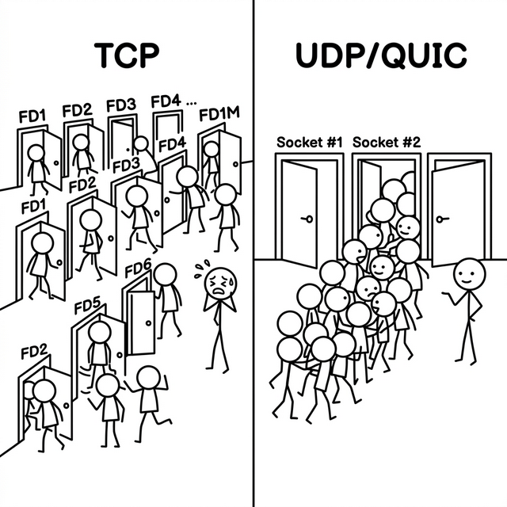
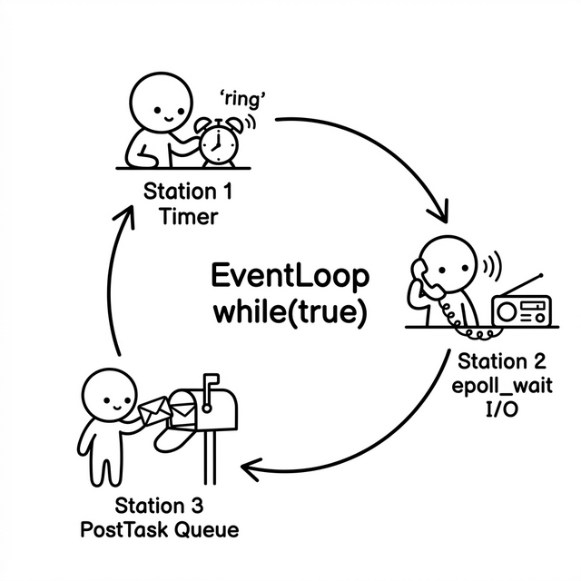

# 3. 管道与枢纽：网络 IO 的架构抽象

如果说零拷贝 Buffer 是网络库奔涌的血液，那么 I/O 网络流的收发框架就是决定这款引擎能否在高压下顺畅运转的心脏。

但当我们准备开始为 `quicX` 搭建这样一个心脏体系时，首先面临的是一场认知的剥离。

---

## 3.1 抛弃 TCP 的思维定势

具备 TCP 开发背景的开发者转向 QUIC 时，很容易把一个隐性假设携带过来：**百万并发连接 = 百万个需要被独立管理的 Socket fd**。

这在 TCP 世界里是有根据的。成熟的 TCP 服务端早已是标准的 `epoll` / `kqueue` 事件驱动模型，并不依赖一线程一连接。但其内在设计依然假设：每一个已建立的 TCP 连接，对应一个由内核维护的独立 Socket fd，意味着百万连接就有百万条流控状态、百万个拥塞窗口版本、百万个需要独立关注的超时计时器。虽然这并非不可解决的问题，但它是整个工程复杂性的重心。

而 `quicX` 面对的 UDP 世界则完全不同。

在服务端视角下，面对排山倒海般的几十万、上百万客户端连入，操作系统层面**并没有**像 TCP 那样为你源源不断地 `accept` 出几十万个全新的对端专属 Socket fd。往往，服务器上只有极少数绑定了特定固定端口的监听 Socket（开启 `SO_REUSEPORT` 后，大概也就是根据 CPU 核心数绑定的十几个）。**所有客户端的流量，不论来自几十万个逻辑连接中的哪一个，全都挤入这少数几个 Socket 口。**

QUIC 的逻辑连接并不由内核的 fd 隔离来实现，而是完全交由应用层协议栈自己实现（基于 UDP 报文中的 Connection ID 字段划分）。



架构重心因此必须转轨为：

**如何单线程极速榨干少数几个高开销 Socket，并在其之上精准调度层次繁重的协议业务代码。**

---

## 3.2 唤醒的必然：需要事件驱动？

如果在单线程里，既然只有区区几个 UDP Socket，最原始、最直觉的做法是什么？
写一个死循环 `while(true)`，并在里面直接调用阻塞的 `recvfrom`，来一个包处理一个包，处理完了再去拉取下一个，似乎非常完美？

然而现实并没有那么简单。

网络编程往往不仅仅是对系统调用的吞噬，它是一个**基于时间流逝运转**的复杂轴承系统。在 QUIC 协议里，"时间"是决定协议生死的绝对要素：
- 如果一个乱序的包 10ms 没有等齐前驱包，就要触发快速重传。
- 探测网络拥塞窗口所需的 PTO（Probe Timeout）几乎每十几毫秒都在游走。
- 握手一旦过去 1 秒没有回音，就必须挥刀断连。

如果你把这根唯一的执行流（线程）死死地阻塞（Blocking）在一个干枯的 `recvfrom` 调用上等待新数据包的降临，那么意味着它被系统雪藏了；此时若有一批定时器在此刻到期该去执行了，这根线程是绝对不可能响应的——整个协议的时间齿轮因此而全面停摆。

除了网卡的原始网络数据，一个成熟单线程往往还要响应所在进程里其他线程抛过来的**异步跨线程召唤**任务。

因此，单靠"来数据就读"是不可行的。我们需要一种既能感知多个系统级网卡触发源，又能**被极其精密的时间刻度（Timeout）随时阻断并唤醒**，甚至能被其他线程强制系统级唤醒的基建。

这就是为什么即便我们最终面对的只是数量极少的 UDP 监听器，在 `quicX` 这种高性能服务端中，依然必须要去引入 `epoll / kqueue` 这类**半同步的系统事件驱动机制（Reactor）**的老伙计。只有它们，才能提供这套**能将 I/O 与时间刻度在同一轮询周期里完美收敛、自洽**的多路复合唤醒能力。

---

## 3.3 跨平台之役：抹平系统的鸿沟

在明确了我们需要事件驱动的底座后，紧接着的第二道关卡，是来自操作系统的深渊。

既然要用类 `epoll` 的多路复用，但 Linux 的底层是 `epoll`，Mac 系统偏向 `kqueue`，而到了 Windows 系统上则是另一套复杂得多的底层机制。同样，这些不同平台的 Socket 句柄（File Descriptor）其读写行为表现、连接属性乃至出错时的错误码查询方式（比如 Linux 的 `errno` 与 Windows 的 `WSAGetLastError()`），简直如同跨鸡同鸭讲。

如果任由上层的发包管线或是状态机代码直接混编系统调用接口，各种 `#ifdef LINUX` 的宏分支就会像繁衍的老鼠一样塞满整个工程，代码马上变成一块无法维护的焦炭。

为了隔绝这些纷乱的平台细节，将业务代码推入极度纯净且安全的沙盒，`quicX` 的网络框架做了两层非常干净的**反转与隔离**：

1. **统一事件监听代理（`IEventDriver`）**：我们抽象出它最根本的职责。上层无需知道下面发生着什么，只需告诉它："嘿，盯住这个 fd，一旦可以 `读/写/报错` 了提醒我"。当你在编写代码时，你只当全世界都采用统一的返回模型（像极简的枚举 `ET_READ`, `ET_WRITE`）；而背地里，是在 C++ 的编译阶段，工程的 Make 机制会根据当前系统挂载匹配的 `xxx_event_driver.cpp`（如 `epoll_event_driver.cpp`），利用多态的动态绑定机制，自动将这层代理严丝合缝地安插在底层。

2. **面向对象的句柄封装（`IO Handle` 与 `IFdHandler`）**：光有监听器不够，冰冷的一长串代表着特定底端资源的整数（Socket、EventFD、TimerFD 等等）也没有任何语义。我们赋予这串数字以灵魂，将其封装归纳化。上层不再是对着孤零零的数字下硬编码分支去处理 `recv` ；而是让不同的处理部件本身去继承统一的回调契约（`IFdHandler::OnRead` 等）。这样一来，事件驱动器（Driver）触发事件后，只会傻瓜式并盲目地去执行对应对象实例绑定的多态回调函数。整个 I/O 的行为分流从面向过程的冗杂分支被彻底转变为**控制反转（IoC）** 的面向对象派发。

这便构成了一层铁壁：最核心的整个 QUIC 协议栈只握着这一套干净的虚函数抽象，决不再触碰操作系统的泥潭。

---

## 3.4 神经中枢：聚焦纯粹的 EventLoop

有了操作系统的系统抽象（`IEventDriver`），也有了懂得处置业务多态的事件句柄（`IFdHandler`），现在只要在最外层架设一个永远转动的风车——**大循环**（Loop），整个流水线就可以跑起来了。这就是整个基础框架里最基础、也最容易招致误解的类：**`EventLoop`**。

在业界著名的并发架构模式 `One-Loop-Per-Thread` 的浸染下，一提到它，无数人很容易形成思维惯性："啊，这就是那个控制多线程并发的管理者"。

必须在这里进行极其严厉的认知撇清：**在 `quicX` 的架构里，`EventLoop` 这个抽象中本身没有任何关于线程控制、线程池分发（比如像 `pthread_create` 或是 `std::thread`管理）的功能。它甚至完全不在乎是哪个进程谁在跑它。**

它本质上就是一根干净的流水线主轴，一个极其纯粹的、循环着 `while` 逻辑的反应器。
它是这三个事件洪流的汇聚点：
1. 它挂载着精密的时间齿轮（**定时器的超时处理**）。
2. 它压榨着网卡的最后一点算力（**因为 epoll_wait 唤醒而触发的多态 I/O `OnRead/Write` 执行**）。
3. 它兼容着本进程内不同业务部件发出的事件召唤（**将跨线程压迫进来的 `PostTasks` 取出并顺序执行**）。

你丢给什么线程执行它，它就一直霸占和使用这个线程的时间片作为引擎驱动力转动下去；你不给它算力打火，它也就是一段静止的类抽象代码。



### 生命的防伪验证：强行断言

然而，虽然它自己不创造线程且没有复杂的全局线程锁，但在随后要铺开的多核扩展业务里，同一个进程下必然会有多个 `EventLoop` 被灌入不同的线程同时跑着多个隔离的大循环。

因为内部的任务队列是单机无锁的，一旦某个错误的调用把指针传串了场，比如线程 A 去偷偷修改了本该线程 B 的 `EventLoop` 里的变量，这本脆弱但极其高效的无锁账单就会面临灾难。
所以 `quicX` 利用了一项极为简单粗暴的自我防伪验证。在 `EventLoop` 一旦被起跑运行时，它的第一件事就是记下当前这根执行流的身份证号码 `std::this_thread::get_id()`。以后你在它这里调用的任何高阶绑定业务操作（比如增减定时器，操作 Fd 绑定等），它劈头盖脸的一句话全是调用宏：`AssertInLoopThread()`。不是当前执行流的串线调用，框架将毫不犹豫地令程序自尽 Crash 掉以阻绝污染。只准从其他线程发起正规渠道通过 `PostTask()` 发送请求任务投递跨栈流转，它会在下一次循环周期亲自自己的线程处理。

正是这个不带任何并发管理负担、没有被加锁拖累、极其克制而纯粹的**单线程流绑定与轮询器**，成为了日后摊薄高频风暴请求的最核心且可以任意横向克隆的阵地。

### 同源唤醒的优化：避免昂贵的系统调用

由于单线程的 EventLoop 每回合都会陷入一种不可自拔的"沉睡"（比如带着定时器刻度阻塞在 `epoll_wait`），如果此刻别的线程给它投来了一个十分紧急的函数希望它跨界马上执行（例如：调用 `Wakeup` 以发送新数据），最标准的做法是往它的专属跨源管道（如 EventFd / Pipe）里暴力写入仅仅一个字节，把这根挂起中的系统调用用 IO 强刺激醒。

在平时的负载下这无可厚非，但这往往引发一个被大家忽视的高发极端场景危机：**自己喊自己唤醒**。

在 QUIC 这个错综复杂的大状态机里，很多时候当前 EventLoop 这根执行流在刚刚执行完一批底层触发的回调函数后，这批被触发的代码自己顺手调用了"我要马上投递异步任务！"这个操作。
此时这根线程本就是由于系统事件唤醒而醒着的（根本没有投入睡眠）！如果还像套公式一样机械地去发起跨内核的写入系统调用，不仅白白消耗这根宝贵的单线程时间，更是对并发吞吐性能的可怕折损。

`quicX` 的源码 `EventLoop::Wakeup()` 做了一件极其简单且四两拨千斤的事：

```cpp
void EventLoop::Wakeup() {
    if (IsInLoopThread()) {
        // 同一线程：绝不去打扰内核，只立一个内存级的免死金牌
        // "This avoids writing to wakeup pipe 26K+ times during packet loss"
        need_immediate_wakeup_ = true;
    } else {
        // 跨线程：才真正需要让内核将沉睡中的 epoll_wait 惊醒
        if (driver_) { driver_->Wakeup(); }
    }
}
```

这个 `need_immediate_wakeup_` 标记的效力发作在下一自然进入 `Wait()` 的时刻：

```cpp
int EventLoop::Wait() {
    // ...处理定时器，计算最近一次超时时长 timeout_ms...

    // 扣检内存级免死金牌：将根型设定的 30ms 挟起强制改为 0，直接闪电空转后冲出
    if (need_immediate_wakeup_) {
        timeout_ms = 0;
        need_immediate_wakeup_ = false;   // 立刻清除，只生效一次
    }
    int n = driver_->Wait(events_, timeout_ms);
    // ...处理 FD 事件 + 跨线程任务队列...
}
```

这轻巧的一招，在诸如大量集中超时重发重算触发唤醒的情景中，抹除了可能打爆机器 CPU 的无谓上下文锁资源切换操作。
