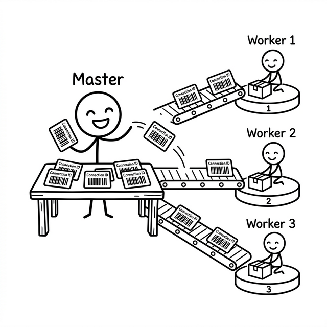

# 4. 打破全局锁：One-Loop-Per-Thread 的无锁演进

在上一章中，我们搭建起了这台引擎的心脏——一个极其纯粹的 `EventLoop`，它被设计为与任何线程管理完全解耦，只管转动自己那三个站点的风车。

但一台引擎是不够的。当真实的服务器要承载几十万条 QUIC 连接时，单个 EventLoop 的算力将成为整个吞吐量的天花板。现代服务器拥有十几二十个 CPU 核心，如果让它们只有一个核心在工作，剩下的全数空转，这是一种资源上的罪过。

**要榨干多核，就必须让多个 EventLoop 同时运转。**

然而，就在我们兴冲冲地准备克隆出 N 个 EventLoop 分配给 N 个线程时，一个家伙悄悄出现在了设计文稿的旁边，冷笑着打了个招呼：**锁（Mutex）**。

---

## 4.1 必要的背景：QUIC 的连接是如何被识别的？

在进入并发设计的细节之前，有一个针对 QUIC 初学者不得不提的背景知识，否则接下来的所有设计动机都会显得莫名其妙。

TCP 的连接识别非常简单粗暴——内核通过 `(源IP, 源端口, 目的IP, 目的端口)` 这个四元组来唯一确定一条连接，每个 `accept` 出来的 Socket fd 天生就是一条连接的身份证，操作系统帮你管理好了一切。

QUIC 运行在 UDP 之上，操作系统层面看不到"连接"的概念，所有数据都是一个个无状态的 UDP 报文。为了在无连接的底层之上建立出有状态的"连接"，QUIC 协议在握手时特别协商了一个独属于本次会话的随机标识符：**Connection ID（连接 ID）**。

此后，无论服务器收到哪一个客户端发来的 UDP 报文，都必须先从报文头解析出这个 Connection ID，才能从内存里找到这条连接绑定的协议状态机，把报文交给它处理。**这个解析和路由的过程，就是整个多线程架构的出发点。**

---

## 4.2 锁是怎么出现的

让我们从最原始的单线程开始。

一个 EventLoop，一根线程，所有的协议状态机都在这里面跑。来了一个 UDP 报文，按 Connection ID 查表，找到对应的连接对象，完成协议处理，周而复始。整个世界里只有自己，没有线程竞争，没有加锁的念头，美好得近乎乌托邦。

但当我们试图为这台机器加入第二根执行流时，问题就此出现。

假设我们把网络接收独立成一个线程（Thread A），把协议处理独立成另一个线程（Thread B）。Thread A 负责从 Socket 拿包、解析 Connection ID，然后去查全局的连接表；Thread B 负责实际执行协议逻辑，同时会创建新连接、注销旧连接，修改这个共享的连接表。

同一时刻，A 在查表，B 在改表——经典的并发写读冲突，答案显而易见：**加锁**。

这把锁刚加上，另一个噩梦就开始了。在高并发的网络服务中，每秒进来的 UDP 报文是百万级别的，每一个报文到来都需要争抢这把全局连接表锁。CPU 在线程切换和锁等待上消耗的开销，很快会吞噬掉因多核并行带来的绝大部分收益。这就是**全局锁的陷阱**——加上去容易，摔掉极难。

---

## 4.3 One-Loop-Per-Thread：从共享走向隔离

打破全局锁的关键，从来不是寻找更精妙的无锁算法技巧，而是一个更根本的架构问题的答案：

**能不能从设计层面，让不同线程之间根本就没有需要共享的状态？**

`quicX` 给出的答案是经典但极其果决的 **One-Loop-Per-Thread**：进程内的每根线程，都独占一个 EventLoop，并且规定所有属于这根线程的资源——连接表、协议状态机、定时器——只能由这根线程访问。

整个系统由两种角色组成：

- **Master 线程**（分拣员）：持有自己的 EventLoop，绑定 UDP Socket，负责接收所有进来的网络报文，按照 Connection ID 路由给对应的 Worker。它完全不做任何协议级的业务处理。

- **Worker 线程（×N）**（处理员）：每个 Worker 绑定一个独立的 EventLoop，独立掌管一批 QUIC 连接的生死。它只处理被 Master 路由分发过来的包，对其他 Worker 的任何状态一无所知，也完全不关心。

两种角色边界清晰，互不越界。



---

## 4.4 Master：无需加锁的报文分拣台

Master 线程接收到 UDP 报文后的第一件事，是把报文头里的 Connection ID 解析出来，然后在一张哈希表里查找这个 ID 属于哪个 Worker：

```cpp
void Master::OnPacket(std::shared_ptr<NetPacket>& pkt) {
    PacketParseResult packet_info;
    if (MsgParser::ParsePacket(pkt, packet_info)) {
        auto iter = cid_worker_map_.find(packet_info.cid_.Hash());
        if (iter != cid_worker_map_.end()) {
            // 命中：Connection ID 已知，精准投递到对应 Worker
            auto worker = worker_map_.find(iter->second);
            worker->second->HandlePacket(packet_info);
        } else {
            // 未知连接（新握手包）：随机选一个 Worker 接纳
            auto iter = worker_map_.begin();
            std::advance(iter, rand() % worker_map_.size());
            iter->second->HandlePacket(packet_info);
        }
    }
}
```

注意这段核心代码里没有任何一把锁。这不是疏忽，而是设计保证：`cid_worker_map_` 和 `worker_map_` 都只归 Master 线程读写，任何时刻都不会被其他线程触碰。

然而 Worker 线程在完成握手后，需要向 Master 注册自己新建的 Connection ID；旧连接关闭时，还需要从表里注销。这是跨线程的修改请求，该怎么办？

答案是：**不直接改，投队列，让 Master 自己改。**

Worker 把操作封装成一个结构体，丢到一个线程安全队列里，然后唤醒 Master 的 EventLoop。Master 在自己的下一个循环回合里，用 `DoUpdateConnectionID()` 把这些待处理操作消费完，自己亲手改自己的哈希表，全程不需要任何外来的锁介入。

---

## 4.5 Worker：单线程绑定的绝对所有权

每一个 Worker 线程持有这些核心资源：

- `conn_map_`：所有连接对象的哈希表
- 协议状态机、TLS 握手上下文
- 发包队列、重传定时器

这些东西**全部无锁**。因为设计已经保证了它们永远只在自己线程的执行流上被读写。

跨线程的唯一入口只有一个：Master 线程投递报文时调用的 `HandlePacket()`。而它的实现极其简洁：

```cpp
void WorkerWithThread::HandlePacket(PacketParseResult& packet_info) {
    packet_queue_.Emplace(std::move(packet_info));  // 丢入线程安全队列
    event_loop_->Wakeup();                          // 敲醒 Worker 的 EventLoop
}
```

报文被投进 `ThreadSafeBlockQueue` 之后，Master 的使命就结束了。Worker 线程在 EventLoop 被唤醒的下一个回合里，用自己的执行流把队列里的报文取出来处理。从队列取出之后，所有后续的协议解析、连接查找、状态机流转，全部都在 Worker 自己的线程里安安静静地进行，再也不需要任何锁的庇护。

---

## 4.6 线程私有的内存王国：thread_local BlockMemoryPool

第二章介绍 `BlockMemoryPool` 时，我们重点关注的是它如何解决大块物理内存的高效分配问题——从池中借、用完还，彻底屏蔽系统调用的频繁损耗。但在多线程场景下，还有一个被刻意留到此处才提的细节：**如果多个线程都向同一个内存池申请和归还内存块，池子内部的队列操作本身就会引发锁竞争。**

即便是一把极轻量的内存池锁，在每秒百万级报文吞吐的热路径上，其累积的开销同样不可小觑。

`quicX` 的解决办法直截了当：**每个线程拥有自己专属的 `BlockMemoryPool` 实例**。

```cpp
// quic/quicx/global_resource.cpp
// 三行 thread_local，彻底了断内存池的锁竞争
thread_local std::shared_ptr<BlockMemoryPool> pool_;
thread_local std::shared_ptr<IPacketAllotor>  packet_allotor_;
thread_local std::weak_ptr<IEventLoop>         thread_event_loop_;
```

`thread_local` 关键字让每根线程在首次访问时懒初始化出属于自己的池实例，实例不跨线程共享。每个 Worker 线程的内存申请和归还，从始至终都在自己私有的池子里完成，不存在任何跨线程竞争的可能。

这是整个无锁演进里最后一块被彻底清除的锁竞争来源。从业务状态到内存分配，`quicX` 的每根线程都真正成为了一座自给自足、互不干扰的孤岛。

---

## 4.7 边界上的妥协：ThreadSafeQueue 的哲学

理想很丰满——每根线程独自运作，自给自足——但现实的代码里始终有两处无法完全绕开的跨线程交汇点：

1. Master → Worker 的报文投递
2. Worker → Master 的 Connection ID 变更通知

在这两处，`quicX` 使用了极度克制的 `ThreadSafeQueue`——一个 `std::mutex` + `std::queue` 拼成的最简单的线程安全队列：

```cpp
void Push(const T& element) {
    std::unique_lock<std::mutex> lock(mutex_);
    queue_.push(element);
}
bool Pop(T& value) {
    std::unique_lock<std::mutex> lock(mutex_);
    if (queue_.empty()) return false;
    value = std::move(queue_.front());
    queue_.pop();
    return true;
}
```

看起来并没有什么特别了不起的地方——这只是教科书级别的互斥队列实现。

但这把锁所保护的，只是"把信件投进邮箱"和"从邮箱取出信件"这两个原子动作本身，**和任何业务代码无关**。单次锁竞争的窗口极小，竞争频率也被 Wakeup 机制控制在仅有新包到来时才触发。

这与"全局锁保护整棵业务大树"的旧模式有着本质的区别：**我们没有消灭全部的锁，而是把锁的管辖领地压缩成了一根细如发丝的投递通道**，让它管好自己分内的薄薄一层，剩下的一切都留给各自线程无忧无虑地驰骋。

---


至此，`quicX` 的并发基石已经全部就位。每一个 Worker 线程都是一座自成体系的孤岛：专属的 EventLoop、专属的连接表、专属的内存池，岛与岛之间仅通过最细的线程安全管道传递消息。整个系统在多核处理器上获得了近乎线性的横向扩展能力，而开发者在各自 Worker 线程内部编写协议代码时，却完全不必为并发安全操一点心。

这种"把并发的复杂性封死在架构边界，向内部业务代码输出一个无并发的假象"的设计艺术，是 `quicX` 整个工程里最值得体味的哲学之一。而在接下来的章节里，我们还将继续与它相遇——定时器、流控、握手，无处不是它的回声。
