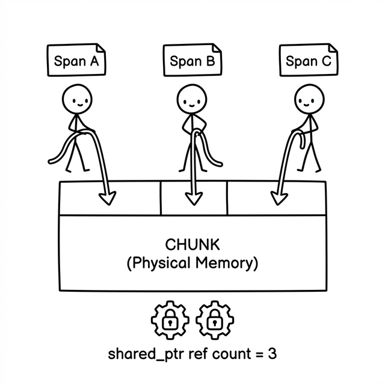
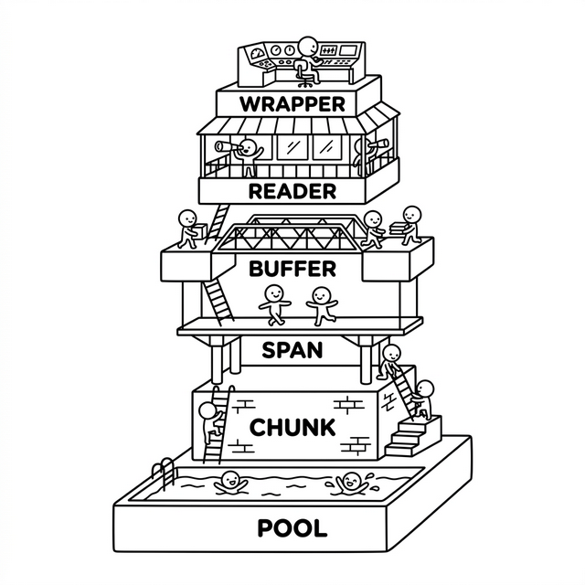

# 2. 拷贝的艺术：零拷贝 Buffer 的生存法则

在上一章中，我们探讨了如何利用连接级的内存池解决海量小对象频繁分配带来的系统耗损。但这仅仅解决了问题的一部分。对于一个高性能的现代网络通信架构（尤其是 QUIC 这样包含多路复用特征的协议），还有另外一个沉重的性能瓶颈：**庞大网络 Payload（载荷数据）的收发、缓存与多级流转。**

网络数据的处理在不同层级面临着截然不同的痛点：  
- 在底层接收 UDP 报文时，需要极速获取大块内存而免于系统调度的开销；  
- 报文到达后被切解分发给多个独立的 Stream 时，需要保证这段内存存活且不被重复释放；   
- 对于上层应用而言，尽管底层是由零散内存块拼凑而成，却需要一个“完全连续”的滑动窗口假象；   
- 而当业务真正去反序列化报文时，更希望拥有一个极其纯粹的读写界面，而不是去和枯燥的内存块搏斗。   

针对这一系列特定问题，`quicX` 抽丝剥茧地自底向上构建了一套各司其职的 Buffer 组件栈。本章，我们将沿着这条主线：从**最小管理内存单元（Chunk）**、**轻量级的引用切片（Span）**、**内存的读写界面（Buffer）**、**安全的只读视图（Reader）**，最后抵达**序列化的操作界面（Wrapper）**，重走这段自底向上的缓存架构演进之路。

---

## 2.1 性能的黑洞：大块共享内存池 (BlockMemoryPool)

在网卡中断触发、UDP 报文如海啸般涌入进程时，我们需要立刻开辟大段的内存空间来装填数据。如果每次都向内核发起 `malloc` 或依赖基于操作系统的 `new`，不仅会引发高昂的跨态上下文切换，长此以往更会在系统堆空间留下难以弥合的内存碎片。网络底层迫切需要的是极速、开箱即用的大块缓存。

针对特定尺寸网络吞吐（如 1KB 或 4KB MTU级别）的普遍规律，`quicX` 剥离了连接的概念，设计了一个统一的固定块内存工厂——**`BlockMemoryPool`**。

它不再拘泥于对象的按需构造，而是专注于大块物理内存的高效流转。`BlockMemoryPool` 会预先向系统申请大量的标准尺寸连续内存块，交由内部队列统一维护。所有的网络读写容器在需要承载真实物理数据时，都会向它发起“借用”。
   
当数据被彻底消费殆尽，这些区块又会原封不动地归还至池中。整进整出的纯粹设计，屏蔽了内核层频繁分配释放的性能损耗。

---

## 2.2 收束物理权责：最小管理内存单元 (IBufferChunk)

当我们从内存池中拿到一整块物理内存后，如果直接在代码中四处传递 `uint8_t*` 指针及长度，系统将立刻陷入混乱：谁来声明这块内存的有效边界？更深层的问题在于，极度追求性能时，内存的来源并不永远是 `BlockMemoryPool`，也可能来源于系统的 `mmap` 或 DPDK 等内核旁路技术。

为了确立内存资源的物理权责，`quicX` 抽象出了 **`IBufferChunk`** 接口。它被定义为**最小管理内存单元**，严厉划定了系统内部每一块物理内存的合法边界。

```cpp
class IBufferChunk {
public:
    virtual bool Valid() const = 0;
    virtual uint8_t* GetData() const = 0;
    virtual void SetLimitSize(uint32_t size) = 0;
    virtual uint32_t GetLength() const = 0;
    virtual std::shared_ptr<BlockMemoryPool> GetPool() const = 0;
};
```

在这里，无论它是由内存池分配的 `BufferChunk`，还是基于外挂来源的 `StandaloneBufferChunk`，都统一遵循这一物理结界的定义，为上层屏蔽了存储介质的差异。

有一点需要格外强调的算力保护原则：**拒绝 `memset`**。   
无论是内存复用还是系统映射，新拿到的 Chunk 中一定充斥着之前遗留的脏数据。但在创建 Chunk 的瞬间，我们绝对禁止调用 `memset` 做清零初始化。在高并发的网络 I/O 中，让 CPU 回头去给整块空白内存涂鸦是一种毫无意义的性能浪费。脏数据的封锁应当由上层更为严密的读写游标来完成。

---

## 2.3 生命周期防线：轻量级的引用切片 (SharedBufferSpan)

拥有一块完整的 UDP 报文 Chunk 仅仅是个开始。在 QUIC 协议复杂的流程中，一个数据包可能解剖出 Stream A 的载荷、Stream B 的结束帧以及连接层的 ACK 帧（如果你还不了解这些QUIC中的概念，不要紧，这里只是为了举例说明接收到的单个数据块会被多个互不相干的流解析使用，QUIC的概念和实现会在后续章节中介绍），这些片段会分别派发给底层数十个互不相干的异步状态机。

如果在传递时进行 `memcpy` 切割拷贝，即增加内存使用，又消耗CPU时钟，大大的不妥。但如果仅传递裸指针切片，在一个多路复用的异步世界里，由于无法知晓所有的状态机何时才能全部处理完毕，底层的 `Chunk` 何时该被安全销毁就成了一道无解的悬案。

零拷贝的精髓，不在于“完全不操作”，而在于“用轻量的引用替代沉重的实体搬运”。为此，`quicX` 引入了极为关键的一层设计：**作为轻量级引用切片的 `SharedBufferSpan`**。

```cpp
class SharedBufferSpan {
private:
    std::shared_ptr<IBufferChunk> chunk_;
    uint8_t* start_ = nullptr;
    uint8_t* end_ = nullptr;
};
```

这就好比投射在实体物理块上的几道轻量级切片。在模块间进行数据分发时，实际传递的是一份份捏着不同 `start_` 和 `end_` 游标的 `SharedBufferSpan`。它底部的 `std::shared_ptr<IBufferChunk>` 则犹如一把锁，守住共享的底层物理内存。

只要任何一个异步模块还在读取其持有的 `Span` 碎片，底层 `Chunk` 的生命计数就不会归零。当业务代码提取完毕，所有经手的组件依次丢弃各自的 `Span` 时，生命之锁解开，实体的 `Chunk` 才会安然脱落并完整回归池内。至此，跨模块的数据读取只流转视图引用，彻底消除底层的数据拷贝压力。



> **关于引用计数的工程权衡**
> 
> 有些对性能极其偏执的开发者可能敏锐地察觉到了：`std::shared_ptr` 的引用计数加减底座通常基于 `std::atomic`，涉及到内存屏障和原子锁开销。在高性能网络中，这种开销是否也是一种负担？
>
> 事实上，这是一种在工程与纯粹性能之间的**克制与妥协**。相较于执行真正的 `memcpy` 甚至触发缺页或缓存未命中带来的沉重惩罚，原子指令的几十乃至百余个周期的开销是极为低廉甚至可以忽略不计的。更重要的是，基于 `shared_ptr` 能够为我们带来绝对无懈可击的多组件生命周期安全性。在这种关键节点的保护下，花一点点纳秒级的原子操作成本（如果是单线程模型也可以优化为非原子引用计数），换取的却是极其粗壮稳健的应用层框架和长久的零拷贝红利。

---

## 2.4 滑动视图的伪装：内存的读写界面 (IBuffer)

有了引用保护的 `Span` 后内存变得安全了，但高层业务直接操作底层碎片过于原始。
比如：网卡 I/O 层需要一个整块的空间去承接单独的 UDP 报文；而协议的 Stream 流模块则期望看到的一个连续不断的数据流。如果让应用层直接去控制大量的 `Span`,  `Chunk` 碎块，无疑会陷入指针拼接的泥潭。

因此，需要在碎裂的底层之上构建出屏蔽细节的**内存的读写界面**，也就是逻辑上“完全连续”的 `IBuffer` 视图，它主要由 `SingleBlockBuffer` 与 `MultiBlockBuffer` 担纲。

### 针对单一报文的铁钳：SingleBlockBuffer
当负责独立 UDP 报文的接收和发送时，由于生命周期聚焦，`quicX` 使用了最轻薄的 `SingleBlockBuffer`。其本质上就是架在单一一块 `Chunk` 上的两把铁钳（`read_pos_` 与 `write_pos_`）。


整个读写过程是纯粹的从左至右单向推进。它不需要复杂的节点扩展，唯一的作用就是向外部提供写入边界，并像一堵叹息之墙一样挡住所有越界访问。这也成为了上文所述“绝不用memset 清零”的安全底气：双钳之外的区域，在逻辑上就是不存在的禁区。

### 对付连绵洪水的滑动窗体：MultiBlockBuffer
当数据汇入上层 QUIC 字节流时，单一的物理块显然无法兜住海量连续的网络数据。这正是 `MultiBlockBuffer` 的出场契机。  

`MultiBlockBuffer` 被塑造成一个具有承载无限长流数据的连绵窗体。它内部采用 `std::deque` 单向管理一系列 `BufferChunk` 堆叠片段。
当底层写入空间告急，它永远向池子申请新的区块拼接在队尾。而在读取端，当排头那块 `Chunk` 的每一个字节被彻底压榨干净后，这个被抽干的节点就像马里奥踩过的悬空木砖，瞬间引发析构并被踢出队列，其内存随之释放归池。


它对外部隐藏掉了内部大块拼装与废弃断桥的过程，向上呈现出了一幅只要有数据到来、就永远能够向后绵延的完美单向线性视图接口, 让使用者感受到数据到来如涓涓溪流，连绵不绝，一片岁月静好。

---

## 2.5 试探的假象：安全的只读视图 (BufferReader)

在 `IBuffer` 提供了平滑连接的读写界面之后，又面临着一个网络解析中更为棘手的现实问题：**数据报文的半残包与预读取假象**。

在真实的协议流解析中，读取方常常会遇到这样的情况：业务试图解析一个长达几十字节的协议帧，但实际上底层当前只凑齐了部分碎片(分层协议中，底层协议并不保证上层协议数据包的单次传递完整性，这在IP包中有有体现)。如果在解析前几个字节时，直接调用 `IBuffer` 使其实体只读游标向前推进，就会触发致命的连锁反应。正如上一节“马里奥过浮桥”设计所述，一旦前一个 `Chunk` 的数据被抽干，它将立刻引发内存析构和归还！如果由于半残包导致数据不够而需要终止解析，此时想要“退回原点”已经是不可能完成的任务——因为承托旧数据的底层物理桥梁已经坍塌并被完全抛弃了。Buffer应该有能力回退读取游标，而不是让外部使用方来维护复杂的中间状态。这就是`BufferReader`诞生的原因。

`IBuffer` 是一条不可逆的单向快车道，用完即毁。为了在绝不破坏这套底层游标单向性的前提下支持复杂的预读取，`quicX` 引入了**安全的只读视图 (`BufferReader`)**。它在 `IBuffer` 之上构建了一个完全独立、轻量级的私有读游标（`read_offset_`）。  
需要预先试探数据时，所有的提取偏移都仅仅记录在 `BufferReader` 虚构的视图空间上，从不调用底层 `IBuffer` 会真正引发游标位移和物理区块析构的方法。
由于底层实际数据毫发无伤，业务在这个沙盒内享有一次免费的"后悔药"——当发现数据不全时，直接销毁这个只读视图对象即可，底层铁钳纹丝不动；仅有当确定获得了完整的逻辑报文后，才会发起极其快速的最终同步 `Sync()` 或者真实游标 `MoveReadPt()`，向底层的 `IBuffer` 下达正式推进步长位移命令。

---

## 2.6 抽离编解码细节：序列化的操作界面 (Wrapper)

即便是拥有了 `IBuffer` 和 `BufferReader` 的双保险，如果在协议层去编写具体的反序列化代码（例如解析 QUIC 特有的可变长整型报文 `VARINT`），依然需要在二进制位操作和基础读取函数之间疲于奔命。每次都要计算偏移行、遇到跨边界还要手动安全转移和拼接临时栈片，代码不仅臃肿，还极易触发致命指针越界。

**`Wrapper 编解码引擎`**（如 `BufferEncodeWrapper` 与 `BufferDecodeWrapper`）便是为此而生，它们成为了面向开发者的**序列化的操作界面**。

它们仅仅是在前置接口之上的一层浅薄然而极其精雕细琢的封装外衣，其内部巧妙地组合了下层的 `BufferReader` 并隐蔽掉了其手工偏移的过程。`Wrapper` 的核心职责是向外纯粹地暴露出一整套诸如 `DecodeVarint`, `DecodeFixedUint32` 这类开箱即用的强类型转换 API 工具。

得益于 `BufferReader` 作为后端机制的支撑，它为协议解码层成功抽象包装出了一个极为直观干净的 **取消操作（CancelDecode）** 功能：
无论刚才进行过几十次怎样繁琐复杂的类型序列化提取，如果中途抛出缺数据预警，调用该方法即可在沙盒内抹去所有私有游标的痕迹记录。只要未执行明确的提交方法 `Flush()`，底层的全套铁钳游标就会原地待命，全须全尾地等待下一波网络报文对残包进行拼接补齐。

在这个面向开发者的抽象界面前，协议层的业务层代码获得了完全摆脱“跨块字节拼接与读游标手动回撤”这些深水脏活死活的解脱。

来看一段最典型的半残包解析处理示例：

```cpp
bool ParseFrame(BufferDecodeWrapper& decoder) {
    // 假设正在提取一个较复杂的 Frame，尝试一次性解码它的各种字段
    uint64_t frame_type;
    uint32_t payload_len;

    // 尝试在沙盒内预读（读取内部只读视图不会修改底层物理铁钳指针）
    if (!decoder.DecodeVarint(frame_type) || !decoder.DecodeFixedUint32(payload_len)) {
        // 【关键环节：数据不够，处理残包】
        // 抹去上述部分尝试读取的偏移行，使得 Reader 视图重回原点，静待再次拼装
        decoder.CancelDecode(); 
        return false; 
    }

    // 假设数据量不够 payload 本身的内容
    if (decoder.GetReadableSize() < payload_len) {
        decoder.CancelDecode(); // 同样取消
        return false; 
    }

    // ... 执行业务层实质提取 ...
    // 当全盘一切顺利，确认我们真的解析完这段逻辑上的连绵数据后
    decoder.Flush(); // 拍板钉钉。真实驱动底部 IBuffer 的 read_pos 向前不可逆地推进
    return true;
}
```

如此这般，开发者只管编写纯粹的逻辑分支，完全不用提心吊胆底本物理数据区块可能因为过早地被废弃造成悬挂的宕机灾难。



在由固定大块共享池作为底层宏观支撑、具有刚性物理边界的最小管理内存单元（Chunk）、负责无惧传递的轻量级引用切片（Span）、负责逻辑连贯的内存读写界面（Buffer）、负责安全无损试探的只读视图（Reader），以及最终面向人类友好的序列化操作界面（Wrapper）共同组成的六级架构体系下，`quicX` 的底层数据骨骼就搭建完成。即保证了接收数据时的实效性，也保证了数据解析时的控制便捷性。
